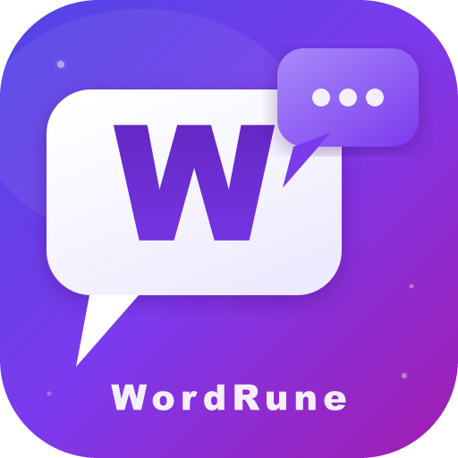
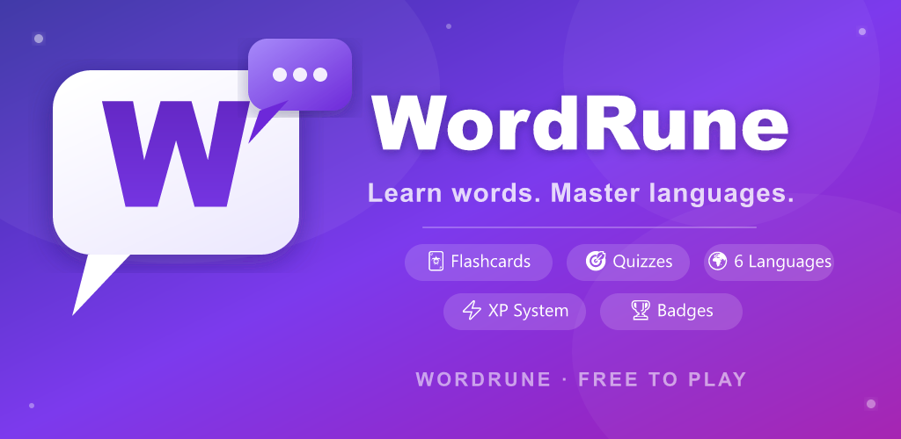

<div align="center">



# WordRune

**Kelime öğrenmenin en akıllı yolu**

[](https://play.google.com/store/apps/details?id=com.wordforge.app)
[](#)
[](#)
[](#)
[](#)

<br/>



<br/><br/>

<a href="https://play.google.com/store/apps/details?id=com.wordforge.app">
  
</a>

</div>

---

## 📱 Uygulama Hakkında

**WordRune**, yabancı dil kelime öğrenimini oyun gibi eğlenceli hale getiren bir Android uygulamasıdır. 8.000'den fazla kelime, 12 farklı çalışma modu ve akıllı tekrar sistemiyle her seviyeye uygun bir öğrenme deneyimi sunar.

> 💬 *"Günde sadece 10 dakika ile fark edilir ilerleme."*

---

## 📸 Ekran Görüntüleri

<div align="center">

 &nbsp;
 &nbsp;
 &nbsp;


</div>

<div align="center">

*Ana Ekran &nbsp;&nbsp;&nbsp;&nbsp;&nbsp;&nbsp;&nbsp;&nbsp;&nbsp;&nbsp;&nbsp;&nbsp;&nbsp; Etkinlik Modları &nbsp;&nbsp;&nbsp;&nbsp;&nbsp;&nbsp;&nbsp;&nbsp;&nbsp;&nbsp; Gelişim Raporu &nbsp;&nbsp;&nbsp;&nbsp;&nbsp;&nbsp;&nbsp;&nbsp;&nbsp;&nbsp;&nbsp; Ayarlar*

</div>

---

## ✨ Özellikler

### 🎮 12 Farklı Çalışma Modu

| Mod | Açıklama |
|-----|----------|
| 🃏 Flashcard | Kartı çevir, anlamı tahmin et |
| 🧠 Quiz | 4 şıklı çoktan seçmeli sorular |
| ✍️ Yazma | Harfleri doğru sıraya diz |
| 👂 Dinleme | Duyduğun kelimeyi seç |
| 🧩 Eşleştirme | Kelimeyi anlamıyla eşleştir |
| 📝 Boşluk Doldurma | Cümledeki eksik kelimeyi bul |
| ⏱️ Zaman Yarışı | 60 saniyede olabildiğince çok kelime |
| ⚡ Hızlı Karar | Doğru/Yanlış refleks testi |
| 🔍 Kelime Avı | Harf ızgarasında kelimeleri bul |
| 📖 Hikaye Modu | Bağlamda okuyarak öğren |
| 🎰 Şans Çarkı | Çark çevir, mod kazan, XP çarp |
| 📅 Günlük Öğrenme | Kişiselleştirilmiş günlük program |

### 📚 İçerik

- **8.000+** kelime — Oxford Word Lists A1–C1 hizalı
- **3 hedef dil** — İngilizce 🇬🇧 · Almanca 🇩🇪 · Fransızca 🇫🇷
- **4 arayüz dili** — Türkçe · İngilizce · Almanca · Fransızca
- CEFR seviyelerine göre sınıflandırılmış kelimeler (A1–C1)
- Kategorilere göre filtreleme: Günlük, İş Hayatı, Teknoloji, Seyahat ve daha fazlası

### 🏆 Motivasyon Sistemi

- ⚡ **XP & Seviye** — Her doğru cevap XP kazandırır, seviye atla
- 🔥 **Seri Takibi** — Günlük çalışma serini koru
- 🧊 **Seri Dondurma** — Bir günü kaçırsan da serin korunur
- 🏅 **50+ Rozet** — Başarılarını koleksiyona ekle
- 🎯 **Günlük Hedef** — Kişiselleştirilebilir XP hedefi
- 📊 **Haftalık İstatistikler** — İlerleme grafikleri ile kendini takip et

### 🔧 Diğer Özellikler

- ☁️ Google hesabıyla cloud yedek (Firebase)
- 🔔 Akıllı bildirimler — seri hatırlatıcı, günlük kelimeler
- 🌙 4 tema — Midnight · Dark · Light · Forest
- 📴 Offline çalışma desteği
- 🔊 Sesli telaffuz (Text-to-Speech)
- 📱 Spaced Repetition sistemi

---

## 🛠️ Teknoloji Stack

```
Frontend        React 19 + Vite 8
Mobile          Capacitor 8 (Android)
Veritabanı      SQLite (lokal) + Firebase Firestore (cloud)
Auth            Firebase Auth + Google Sign-In
Abonelik        RevenueCat
Reklamlar       Google AdMob
Bildirimler     Capacitor Local Notifications
TTS             Capacitor Text-to-Speech
```

---

## 🔒 Gizlilik & Yasal

- [Gizlilik Politikası](./privacy-policy.md)
- [Hesap Silme](https://sessizmuezzin.github.io/wordforge-privacy/delete.html)

---

## 📬 İletişim

Geri bildirim, destek veya iş birliği için:
📧 muhammet.guldn@gmail.dom

---

<div align="center">

**© 2026 WordRune · Tüm hakları saklıdır.**

*Google Play ve Google Play logosu Google LLC'nin ticari markalarıdır.*

</div>
